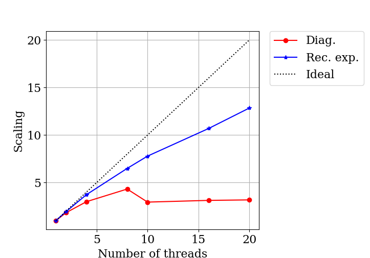
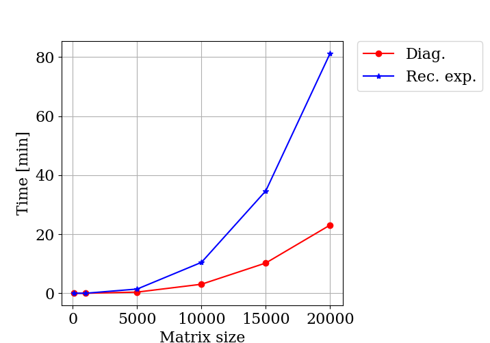
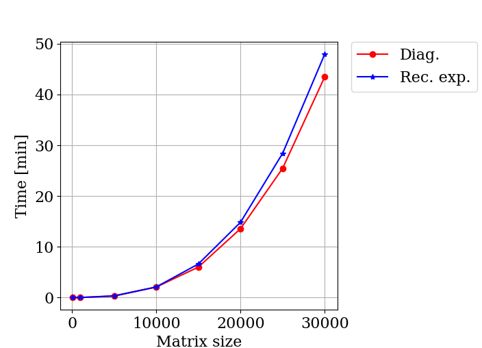
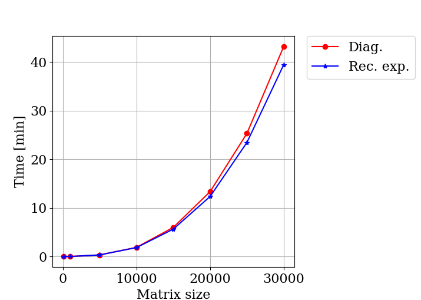

Project results
================

The code for the recursive expansion is implemented in the *denmatlib* package. We created our own class representing dense matrix and use it for all calculations. The main goal of the project is to get used to the Python programming language, discover its main features and utilizing available debugging and profiling tools. For debugging we used *pdb* command line debugger. For profiling we used various tools described in more details in section :ref:`prog_in_python`.

Our expectations
--------------------

In this project we compare computation of the density matrix using
diagonalization and using recursive expansion. We consider dense matrices.
Diagonalization gives full information about the matrix, i.e. all
eigenvalues and corresponding eigenvectors. Instead, recursive expansion
provides information about invariant subspaces, so called occupied and
unoccupied subspaces and no explicit information about eigenvalues and
eigenvectors unless additional steps are performed. Thus recursive expansion
provides less detailed information about the eigenspectrum that the
diagonalization. 

The computational time for both methods scales cubically with system size.
Performance of a method depends on the particular implementation and hardware available. Matrix multiplication, which is the main operation in the recursive expansion, is easily parallelizable compared to the diagonalization.

Timing results
--------------------

Here we present our results for both methods executed for random dense symmetric matrices, with spectrum generated such that eigenvalues of :math:`X_0` are equidistantly distributed in intervals :math:`[0, 0.45]` and :math:`[0.55, 1]`, where :math:`\lambda_{n_{occ}} = 0.55` and :math:`\lambda_{n_{occ}+1} = 0.45`. 

For diagonalization we use numpy.linalg module and the python code for generation of the density matrix is the following:

.. code-block:: python

  w, v = la.eigh(X)
  DM = np.dot(v[:, -nocc:], v[:,-nocc:].T)
  

The python script comparing both algorithms can be found on git:
https://github.com/Tourmaline/densmatlib/tree/master/compare_recexp_and_diag.

We perform our tests on `Rackham computer
cluster <http://www.uppmax.uu.se/resources/systems/the-rackham-cluster>`__ at
UPPMAX center, Uppsala, Sweden. Each node has two 10-core Intel Xeon V4 CPU's, so in total 20 cores. We use Python 2.7.13 with numpy precompiled with OpenBLAS library.

In all our tests recursive expansion required 18 iterations, thus 18 matrix-matrix multiplications. We present figures showing strong scaling with number of threads and scaling with system size for both methods for various number of threads.

    Strong scaling of both methods for matrix size 20000.
   
   

    Scaling with matrix size of both methods using 2 threads for BLAS library.
  

     Scaling with matrix size of both methods using 16 threads for BLAS library. 

    Scaling with matrix size of both methods using 20 threads for BLAS library.     
    
      
      
      
      
      
      
      
      
      

